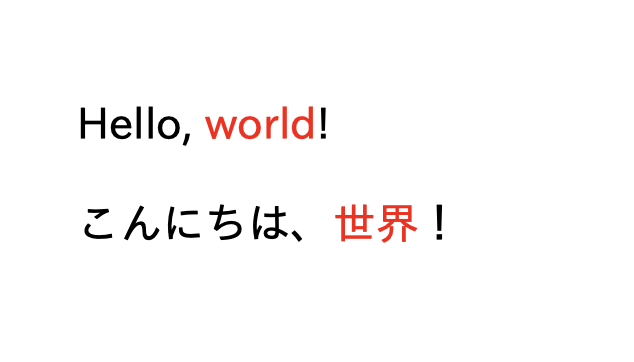

# Twirl で作成した HTML テンプレートを PDF に出力する

## 使用するライブラリ

- [Twirl](https://github.com/playframework/twirl): v1.5.1
- [openhtmltopdf](https://github.com/danfickle/openhtmltopdf): v1.0.9

## 日本語フォントの読み込み

`example/src/main/resources/fonts` 下に日本語フォント (`.otf` ファイルはサポートされていないので、`.ttf` ファイルのみ) をダウンロードし、Scala と HTML テンプレートにて読み込む。

```scala
object SimplePdfJapanese {

  def main(args: Array[String]): Unit = {
    val fontUrl = "example/src/main/resources/fonts/ipaexg.ttf"
    (for {
      os      <- Try(new FileOutputStream("/tmp/out-japanese.pdf"))
      font    <- Try(new File(fontUrl))
      builder  = new PdfRendererBuilder()
    } yield {
      builder.useFastMode()
      builder.withHtmlContent(html.SimplePdfJapanese(font.getAbsolutePath()).toString, "")
      builder.toStream(os)
      builder.run()
    }) match {
      case Success(_) => println("Completed with no exception")
      case Failure(e) => println(e.getMessage)
    }
  }
}
```

`SimplePdfJapanese.scala.html`:

```html
@(fontUrl: String)

<html>
  <head>
    <style>
      @@font-face {
        font-family: 'ipa';
        src:         url(file:@fontUrl);
      }
      * {
        font-family: 'ipa', sans-serif;
      }
    </style>
  </head>
  <body id="content">
    <p>Hello, <span style="color: red;">world</span>!</p>
    <p>こんにちは、<span style="color: red;">世界</span>！</p>
  </body>
</html>
```

`SimplePdfJapanese` を実行すると以下の PDF 出力が得られる。

